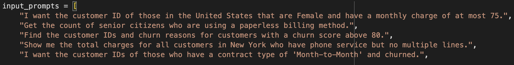
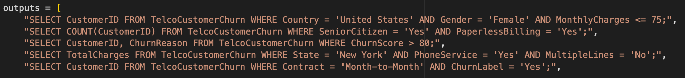
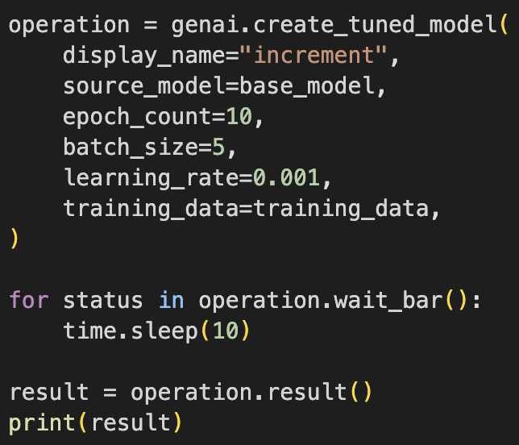
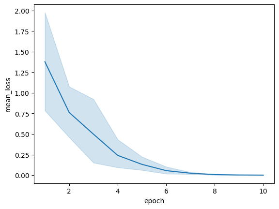
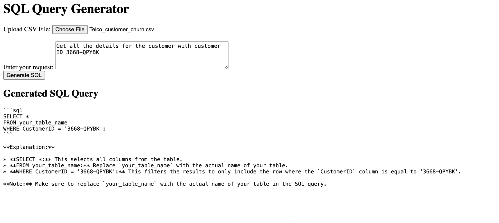

# verizon-sql-autobi

Auto-BI tool to generate SQL queries for Verizon's datasets.

<!--
Project repo instructions
https://lms.ecornell.com/courses/1788003/pages/step-1-ensure-your-project-repo-is-complete-by-dec-8th-team-to-do

Project README instructions
https://lms.ecornell.com/courses/1788003/pages/step-2-ensure-your-project-readme-is-complete-by-dec-8th-team-to-do
-->


## Table of Contents

| Section |
| --- |
| [Project Overview](#project-overview) |
| [Objectives and Goals](#objectives-and-goals) |
| [Methodology](#methodology) |
| [Results and Key Findings](#results-and-key-findings) |
| [Visualizations](#visualizations) |
| [Potential Next Steps](#potential-next-steps) |
| [Sample Datasets](#sample-datasets) |
| [Colab Notebooks](#colab-notebooks) |
| [Installation Instructions](#installation-instructions) |
| [License](#license) |
| [Credits and Acknowledgments](#credits-and-acknowledgments) |
| [Individual Contributions](#individual-contributions) |


## Project Overview

This is our group's second project for Break Through Tech AI's Fall 2024 AI Studio program. To learn more about our first project, visit our GitHub repo here: https://github.com/Verizon-4/Foliage

After pivoting from the foliage computer vision model, Verizon challenged us with a new Large Language Model (LLM) project using Natural Language Processing (NLP) techniques. Our goal was to build a Business Intelligence (BI) tool for natural language data interaction: given an input dataset and query in natural human language, our model would generate an SQL query for that specific data and query.


## Objectives and Goals

We wanted to create a user-friendly NLP project to simplify data access for non-technical users. Many employees at Verizon are from a non-technical background, so our project aimed to give them a means to analyze and gain insights into large amounts of data. This would help teams enhance their decision-making processes through consistent analyses for Verizon executives, IT teams, and more. Such a tool would also allow for high accuracy in automating SQL query generations in short amounts of time.


## Methodology

Our project involved starting with a pretrained LLM then fine-tuning it to tailor the model to our needs. We first had to decide which model to use; we were presented with two possibilities (ChatGPT and Gemini), and explored both of them. For ChatGPT, several of our team members had ChatGPT Plus so they created a new model to give it information from the dataset we were working with (see the "Sample Dataset" section below). For Gemini, we created a notebook and used an API key to fine-tune an existing model. In the end, we decided to choose Gemini because it was more customizable and flexible since we could code and fine-tune it and generalize it to whichever dataset we wanted. After fine-tuning Gemini, we built a web application with HTML, CSS, and Flask for the backend to send requests to the model.


## Results and Key Findings

Our final web application allows users to upload a CSV dataset and input a prompt, then will display the generated query after the user submits the relevant information. Our app sends the user's input data to the backend, which extracts the relevant information from the CSV file (e.g. column names) and combines that metadata with the user's prompt to generate a new prompt to feed into the Gemini LLM. It sends the query that Gemini returns back to the frontend to dispaly it to the user.

Our current application uses a pre-trained model without any fine tuning. If given more time, we would deploy and make API calls to our fine-tuned model to improve model output results. Another issue we ran into was that Gemini didn't know the possible column values, which caused it to generate inaccurate queries. For example, it would generate `PaymentMethod = 'Credit card (automatic)'` rather than `PaymentMethod = 'Credit card'`. If given more time for this project, we would also generate a context file to feed into the model containing all the possible values of relevant columns in the given dataset.

Check out our deployed application here: https://verizon-sql-autobi.onrender.com/


## Visualizations

### Fine-tuning code

<p float="left">
  
  
  
</p>

### Fine-tuning Loss Curve

<p float="left">
  
</p>

### Web Application

<p float="left">
  
</p>


## Potential Next Steps

If given more time, we would enhance the model's capabilities by adding image reading functionality. We would also use a similar interactive tool to validate creation of SQL queries and improve prompting by taking user feedback and integrating it to future prompts as few shot learning.

We could also combine our two Verizon AI Studio Projects by integrating Reinforcement Learning with AI Feedback (RLAIF) into the interactive tool for evaluating CV model performance. For a given set of images, we would use autoBI to query the network dataset about network performance at the location of each image.


## Sample Datasets

The dataset we used for testing is [Telco Customer Churn](https://www.kaggle.com/datasets/abdallahwagih/telco-customer-churn?resource=download) by Kaggle. To download this dataset, run the following command in your terminal:

```
curl -L https://www.kaggle.com/api/v1/datasets/download/abdallahwagih/telco-customer-churn -o telco-customer-churn.zip
```


## Colab Notebooks

Our notebooks are all located in this repository and have a `.ipynb` extension.


## Installation Instructions

To run the Colab notebook, ensure you have the following installed: Python, pandas, seaborn, sklearn.

Run the web app using the following link: https://verizon-sql-autobi.onrender.com/


## License

Apache License 2.0


## Credits and Acknowledgments

Team Members: Adya Mohanty, Hridia Tanha, Katherine Chang Wu, Kiran Mitra, Vivian Liu  
Verizon Challenge Advisors: Arthur Lusty, Arun Vonoz, Michael Hanson, Priyanka Giglio  
TA: Yu-Chi (Kade) Lin


## Individual Contributions

Adya Mohanty: Built the entire frontend (HTML/CSS) and backend (Python Flask) for the web application and deployed it using Render.

Vivian Liu: Communicated with Verizon Challenge Advisors through the transition from the Foliage Project to current AutoBI project. Authored notebook (`Vivian_AutoBI_LLM.ipynb`) exploring and fine-tuning the Gemini LLM. Wrote README.
